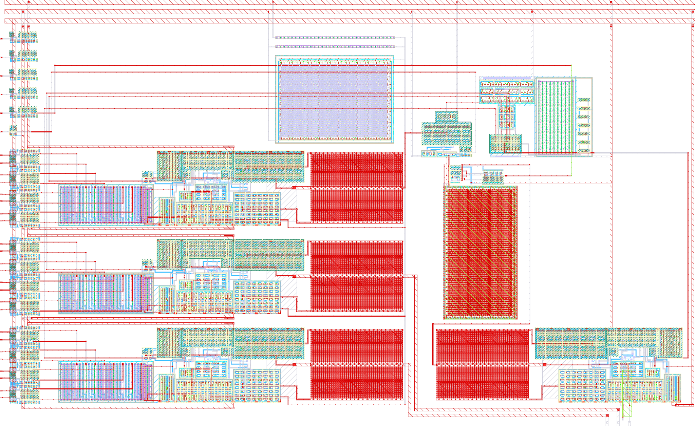

# analogue_interface: analog hard macro (ihp-sg13cmos5l)

<p align="center">
  <a href="final/render/analogue_interface_white.png">
    
  </a>
  <br>
  <em>Render of the dry-run macro. The render shows mask layers only, so the dummies (outline + text) are not visible.</em>
</p>

This is the analog hard macro that `heichips26_FAIf` instantiates as `analogue_interface`.

- The analog blocks of [`heichips26_FAIf.sch`](../../schematic/xschem/heichips26_FAIf.sch) are placed with their GDS as it is.
- The iVREF divider (R1, R2, C1) is generated from the PDK PCells.
- **Routed so far: the DAC path** (round 1, see [Routing](#routing-dac-path-round-1)). Still open: the ADC path (x6/x4, x8, x10, x1, x2, x9, spares) and the PTAT x3 (placed east of the comparator, routed together with the ADC path).

Everything is generated by [`scripts/build_analogue_interface.py`](scripts/build_analogue_interface.py) from one placement and pin table. Do not edit the GDS by hand; change the table and rebuild. The plan behind this macro is [`analogue_interface_dummy_PLAN.md`](../../../../analogue_interface_dummy_PLAN.md).


## Build

```sh
nix-shell
export PDK_ROOT=$(pwd)/IHP-Open-PDK && export PDK=ihp-sg13cmos5l
make -C macros/heichips26_FAIf/macros/analogue_interface build-top
```

| Target | Output |
|---|---|
| `layout` | `layout/analogue_interface.gds`, `final/lef/`, `final/vh/` (Verilog blackbox header), `final/lib/` (timing-free Liberty) |
| `copy-gds` | `final/gds/analogue_interface.gds` |
| `render-gds` | `final/render/*.png` |
| `build-top` | all of the above |
| `klayout-drc` | `verification/drc/` (KLayout DRC, `DRC_LEVEL=macro` by default) |
| `reference-schematic` | regenerates `schematic/xschem/analogue_interface.sch/.sym` (LVS reference) from the top schematic |
| `klayout-lvs` | `verification/lvs/` (KLayout LVS against the reference schematic) |

`layout` and `reference-schematic` need `PDK_ROOT` and `PDK` (the divider PCells come from the PDK library).

The script stops with an error if a block leaves the macro, two blocks are closer than 3 µm, anything is drawn above Metal3, a pin label cannot be found, a route comes too close to block metal or another net, or a routed net is split or shorted (metal-only connectivity check).


## Geometry

- **Size:** 300 × 185 µm, 1 nm dbu, `prBoundary` at (0,0)–(300,185).
- **Layers:** Metal1–Metal3, with one exception: the **Metal4 lid (VSS) over the hold cap of `sah_12bit`** (x10) and its Via3 rows. Otherwise there is no Via3/Metal4/TopMetal1, so the top-level Metal4 PDN straps can run across the macro.
  - The build script allows Via3/Metal4 only inside the lid. The Metal4 PDN strap groups over the macro sit at x 172.38–179.38, 222.38–229.38 and 272.38–279.38 (measured in `final/gds/heichips26_FAIf.gds`, 2026-10-08).
  - LibreLane removes every Metal4 strap within `PDN_HORIZONTAL_HALO` = 10 µm of a Metal4 obstruction. The script therefore asserts that the lid's obstruction (lid + 1 µm) is ≥ 10.5 µm from the **west group (172.38–179.38), which stays intact**. Today it is 10.5 µm (obstruction at x 189.88).
  - The east group (222.38–229.38) is cut over the S&H; the lid keeps the ≥ 0.6 µm Metal4 spacing to it.
  - The LEF obstructs Metal1–Metal3 over the whole macro except the pins, and Metal4 over the lid + 1 µm. The rest of Metal4 is not obstructed.
- **Cell names:** every subcell is prefixed `heichips26_FAIf_` for chip-level uniqueness. This also removes the leading digit of `555_comparator`. The top cell is `analogue_interface`, the module name used in `rtl/heichips26_FAIf.sv`.
- **Location in `heichips26_FAIf`:** (190, 8.82), orientation N (`DIE_LOCATION` in the build script). The macro then covers die x 190–490 and y 8.82–193.82, and leaves x < 180 (after the 10 µm horizontal macro halo) for the digital logic.
  - **x = 190:** only at this x are `analog_0..2` directly above the die pins of `heichips26_template_small_analog` (x = 450.24 / 455.04 / 459.84).
  - **y = 8.82:** this keeps the bottom cell row (y 3.78–7.56) free, together with `FP_MACRO_VERTICAL_HALO: 1` and `PDN_VERTICAL_HALO: 1`. That row's power rails are the only link between the Metal4 straps over the macro and the rest of the power grid. 8.82 is a multiple of 0.42 µm, so the west-edge pins stay on the Metal3 tracks.

```
y=185 ┌─────────────────────────────────────────────────────────────────────┐
      │ VAPWR / VGND / VPWR pin straps (Metal3, x 2–298)                    │
  172 ├──────┬───────────────────────────────────┬──────────────────────────┤
      │ 4×LT │                                   │          PTAT x3 (MX)    │
      │ x9 LT│              R1/R2/C1 (iVREF)     │  x1 comp                 │
  124 │ x2 ↓ │                                   │──────────────────────────│
      │LT8 x6│ R2R DAC x4 (SAR DAC)              │ S&H sah_12bit x10        │
   86 │LT8 x7│ R2R DAC x5 (DAC0 → analog_1)      │                          │
   48 │LT8x12│ R2R DAC x11 (DAC1 → analog_2)     │ opamp x8 (mirrored)      │
   10 │      │                                   │                          │
    0 └──────┴───────────────────────────────────┴───────────▲▲▲──────────┘
       west edge: digital pins (Metal3)          analog_0/1/2 (Metal2)
```

Why the blocks sit where they do:
- **West column:** all level translators face the digital logic, so the VPWR domain stays in this one column.
- **DAC rows:** each 8× translator is rotated R90 next to its DAC row, with its LIN inputs facing west and its nLOUT outputs facing the DAC's nD inputs.
- **East column:** the ADC front end sits next to the analog pins. The opamp is mirrored so its IOAP input is directly above `analog_0..2`.
- **Comparator:** at y 112, as close to the SAR DAC as its strap slot allows (7.8 µm from x4), with INN straight above the S&H's SH_OUT spine.
- **S&H (x10):** between the opamp and the comparator. The hold cap sits in the strap slot x 179.4–222.4, 10.5 µm from the west strap group. The switches sit in a strip left of the cap, right under the comparator.
- **PTAT (x3):** east of the comparator, mirrored (MX) so its outputs (CSOUT1–4, PBIAS) face down, next to the comparator's PBIAS. iIREF2–4 run west to the DACs, iIREF1 down to the opamp (ADC round).


## Blocks

Coordinates are macro-local in µm and give the lower-left corner of each placed block.

| Inst | Part | Source layout | Orient | Lower-left | Size (µm) | Status |
|---|---|---|---|---|---|---|
| x12, x7, x6 | 8x inverting level translator | `../8x_inverting_digital_level_translator/layout/8x_inverting_digital_level_translator.gds` | R90 | (4, 9.35), (4, 47.35), (4, 85.35) | 13.145 × 33.61 | KLayout DRC/LVS clean (cell) |
| x11, x5, x4 | R2R DAC with output opamp | `../r2r_dac/layout/r2r_dac.gds` | R0 | (25, 10), (25, 48), (25, 86) | 147.82 × 32.315 | KLayout DRC/LVS clean (cell) |
| x3 | PTAT current source | `../ptat_current_source/layout/ptat_curr_gen.gds` | MX | (205.43, 112) | 48.58 × 34.80 | KLayout DRC/LVS clean (cell); not routed yet (with the ADC round) |
| x2 | down translator (`adc_comp`) | `../down_digital_translator/layout/down_digital_translator.gds` | MY | (4, 124.5) | 3.24 × 4.90 | layout, unverified |
| x9 | level translator (`adc_hold`) | `../digital_level_translator/layout/digital_level_translator.gds` | R0 | (4, 132.4) | 12.12 × 5.05 | layout, unverified |
| xcap0–3 | level translator (`sh_cap_en[0..3]`) | same as x9 | R0 | (4, 140.45 / 148.5 / 156.55 / 164.6) | 12.12 × 5.05 | **not in the top schematic yet** |
| x8 | opamp (S&H input buffer) | `../opamp/layout/op_amp_ver_2.gds` | MY | (187, 10) | 105.66 × 32.29 | layout, unverified |
| x10 | sample-and-hold `sah_12bit` | `../sah_12bit/layout/sah_12bit.gds` | R0 | (179.2, 45.5) | 43.0 × 63.5 | layout, DRC/LVS clean (cell) |
| x1 | comparator | `../comparator/layout/555_comparator.gds` | R0 | (180.63, 112) | 21.80 × 19.81 | layout, DRC/LVS clean |
| R1, R2 | rhigh w=0.5 µm l=50 µm b=0 (≈ 148 kΩ), PDK PCell | generated (`macro_routing.make_divider_cells`) | R90 | (118, 166.4), (118, 162.5) | 51.22 × 0.90 | routed |
| C1 | cap_cmomi w=50 µm l=2 µm, Metal2–Metal3 (≈ 45 fF), PDK PCell | generated | R90 | (118, 156) | 50.98 × 3.48 | routed |

The divider devices come from the PDK PCell library (`SG13_dev`, loaded through `sg13cmos5l_pycell_lib`), converted to static, flattened cells. C1 is only ≈ 45 fF with the schematic values; check whether that is enough filtering for iVREF.

xcap0–3 are needed because the trimmed S&H's `cap_en` runs in the 3.3 V domain, while every digital-side pin of the macro is in the 1.2 V domain.

The r2r_dac GDS carries a TopMetal1 text label (`ODACOUT`, 126/25). The build script strips it, because TopMetal1 must stay empty.


## ADC front end: opamp x8 → S&H x10 → comparator x1

| Net | From | To | Route (macro) |
|---|---|---|---|
| SH_IN | opamp OOA, west end of its Metal3 strip (187.01, 26.3) | S&H pin `SH_IN`, bottom edge (186.4, 45.5) | Metal3 0.4 µm: (186.2, 26.3) → up to y 44.0 → (186.4, 44.0) → pin; ≈ 20 µm |
| SH_OUT (hold node, `iSAR_AN`) | S&H pin `SH_OUT`, top edge (191.43, 109.0) | comparator INN, Metal3 pad (191.43, 121.7) | 12.7 µm straight up on Metal3 (9.7 µm of it inside the comparator) |
| VSS | S&H pin `VSS`, top edge (192.43, 109.0) | comparator GNDA (south edge, Metal1, y 112.04–112.82) | 3 µm hop up next to SH_OUT, then to VGND |
| iSAR_DAC | x4 ODACOUT, east edge (172.82, 102.3) | comparator INP, Metal3 pad (191.53, 122.37) | Metal3 x 173.4–173.8 up to y 122.37, then east into INP |
| SH_EN | x9 LOUT (13.09, 134.42, Metal2) | S&H pin `SH_EN`, west edge (179.2, 83.9) | LOUT on Metal2 east to x ≥ 13.6 (the VAPWR trunk is at x 11.70–12.81), up to Metal3 east to x 22.5, Metal2 down x 22.5 to y 83.9, Metal3 east at y 83.9 between the VAPWR (81.4–82.2) and VGND (84.7–85.5) rails |
| VDD | S&H pin `VDD`, west edge (179.2, 91.5) | VAPWR | |

Routing rules (see `../sah_12bit/README.md`):
- SH_OUT is a direct Metal3 hop to INN; nothing runs alongside it except the VSS hop.
- iSAR_DAC splits the channel x 172.82–179.2 from the DAC edge (y 102.3) up to the comparator. So SH_EN comes in from the south through the x5/x4 corridor and never crosses iSAR_DAC.
- SH_IN, SH_OUT, SH_EN and iSAR_DAC don't cross anywhere. The DAC routes keep ≥ 7.9 µm from SH_IN: analog_1 runs at x 178.3, analog_2 at x 175.6.
- The comparator OUT (SE corner) is routed east and north around the comparator, never west across iSAR_DAC or along the SH_OUT hop.
- No routing over the S&H on Metal1–Metal3 (LEF obstruction) or over its lid on Metal4 (LEF obstruction).


## Routing (DAC path, round 1)

All routes are generated by [`scripts/macro_routing.py`](scripts/macro_routing.py) from the pin labels of the placed blocks, into the cell `heichips26_FAIf_routing`. Signals use Metal2/Metal3 (0.30 µm, 0.19 µm vias with 0.30 µm pads). The builder runs two checks before it writes the GDS: a clearance check of every route against the block metal and between nets, and a metal-only connectivity check (every routed net is one Metal1–Metal3 island, no two routed nets touch).

| Net | Route |
|---|---|
| `dac_out[15:0]` | Metal3 stub from the west pin to LINk of x12/x7, Via2 down |
| translator → DAC bits | Via2 at nLOUTk, Metal3 east along the nLOUT row; bits 0–3 drop on Metal2 onto the nD pad stack, bits 4–7 go up on Metal3 (staircase, no crossings) |
| iVREF | R1/R2/C1 east ends → Metal2 trunk at x 173.6 → along the row gap under x11/x5/x4 on Metal3 → into the R2R at x ≈ 123.5 (between the opamp POAVSS rail end and the output stage) → west at R2R + 2.5 → up onto IDACVTAP |
| `analog_1` / `analog_2` | Metal3, 1.2 µm, from the opamp OOA bar at the R2R east edge: down at x 178.3 / 175.6, east at y 7.0 / 4.5, Via2 array + Metal2 onto the south pins |
| IDACDISABLE (x11, x5) | Metal3 west to x 61.9, down, onto the opamp POAVSS rail (VGND) |
| VPWR / VGND / VAPWR | Metal3 trunks continue the translator supply bars (x 5.35–6.46 / 9.29–10.40 / 11.70–12.81) up to the straps; VGND and VAPWR cross the lower straps on Metal2. Metal3 rails in the row gaps feed the R2R opamp rails (x11, x5, x4); VGND hops under the VAPWR trunk on Metal2 |
| R1 / R2 / C1 | west ends: Metal2 risers to VAPWR (x 117) and VGND (x 115) |

Kept free for the ADC round: Metal3 at y 83.9 and Metal2 at x 22.5 (SH_EN), Metal3 x 173.4–173.8 for y 102–122 (iSAR_DAC). The PTAT routes (iIREF1–4, PBIAS, supplies) follow in the ADC round.

**LVS:** the reference schematic [`schematic/xschem/analogue_interface.sch`](schematic/xschem/analogue_interface.sch) is generated by [`scripts/gen_reference_schematic.py`](scripts/gen_reference_schematic.py) from the analog part of the top schematic (x1–x12, R1, R2, C1, plus the spares xcap0–3), with the nets renamed to the macro ports. As long as the ADC path is unrouted, the full macro LVS cannot match (the flat comparison cannot pair even correctly routed nets); it becomes the sign-off check after the ADC round.


## Pins

| Pin | Dir | Layer / edge | Connects to (once routed) |
|---|---|---|---|
| `adc_ref[7:0]` | in | Metal3, west | LIN0–7 of x6 → SAR DAC x4 |
| `adc_hold` | in | Metal3, west | LIN of x9 → S&H `SH_EN` |
| `adc_comp` | out | Metal3, west | DOUT of x2 ← comparator x1 |
| `dac_out[7:0]` | in | Metal3, west | LIN0–7 of x7 → DAC0 x5 |
| `dac_out[15:8]` | in | Metal3, west | LIN0–7 of x12 → DAC1 x11 |
| `sh_cap_en[3:0]` | in | Metal3, west | LIN of xcap0–3 → S&H `cap_en[3:0]` |
| `analog_0` | inout | Metal2, south, x 259.74–260.74 | opamp x8 IOAP (ADC input) |
| `analog_1` | inout | Metal2, south, x 264.54–265.54 | DAC0 x5 output |
| `analog_2` | inout | Metal2, south, x 269.34–270.34 | DAC1 x11 output |
| `VPWR` | power | Metal3 strap, y 173–175 | 1.2 V, level translators |
| `VGND` | ground | Metal3 strap, y 177–179 | all blocks |
| `VAPWR` | power | Metal3 strap, y 181–183 | 3.3 V, analog blocks |

Each west-edge pin is 1.0 × 0.4 µm and sits at the height of the block input or output it will connect to. All pins are drawn on drawing, pin and text datatypes (e.g. 30/0, 30/2, 30/25), as in the template floorplans.

The LEF declares `USE POWER` for VPWR and VAPWR and `USE GROUND` for VGND. The Liberty has no timing arcs; it defines `voltage_map` VPWR 1.2 V, VAPWR 3.3 V and VGND 0 V.


## Known issues (not fixed in this version)

- **PTAT:** the GDS predates `ptat_curr_gen_mod1`. It has `CSSTARTUP`, but no `CSOUT4` and no `PBIAS`, and the GDS cell is named `ptat_curr_gen`. The symbol `ptat_curr_gen_mod1.sym` also declares `CSOUT3` twice, which shorts iIREF3 and iIREF4 in the top schematic.
- **Verification:** no block has an LVS result, and only r2r_dac has DRC reports. In r2r_dac the `IDACIREF` label is missing.
- **DRC (`make klayout-drc DRC_LEVEL=macro`, 2026-10-04): 12 errors, all inside existing blocks.** None come from the placement, the pins or the dummies.
  - `CMOS5L.FORB.nBuLay` ×8 in `ptat_curr_gen`: the PTAT draws an nBuLay ring (32/0) around x 5.6–18.2, y 24.9–33.2, and nBuLay is forbidden in the CMOS5L stack. This has to be fixed in the PTAT layout.
  - `Act.b` ×4 in `down_digital_translator`: Activ space below 0.21 µm near y 3.8–3.9.
- **Schematic:** the top schematic still uses the untrimmed `sample_and_hold.sym` and has no translators for `cap_en`.
- **RTL:** `rtl/heichips26_FAIf.sv` ties `sh_cap_en` to `4'b0000` until the config register exists.
- **Location-dependent pins:** the analog pins only line up with the die pins, and the west-edge pins only sit on the Metal3 tracks, at location (190, 8.82). Change `DIE_LOCATION` and rebuild if the macro moves.
- **Metal4:** apart from the `sah_12bit` lid (obstructed), it is not obstructed, so top-level signal routes may cross the analog blocks. The Metal4 keep-out plan is still open (TAPEOUT_PLAN §5.4).


## LibreLane integration

The macro is used in `../../flow/librelane/config.yaml`:
- `FP_DEF_TEMPLATE: dir::heichips26_template_small_analog.def`;
- a `MACROS: analogue_interface` entry with the `final/` views and the instance at `[190, 8.82]`, orientation `N`;
- `VDD_NETS: [VPWR, VAPWR]` and `GND_NETS: [VGND, VGND]`;
- `FP_MACRO_VERTICAL_HALO: 1` and `PDN_VERTICAL_HALO: 1`.

The power pins are connected through the RTL: the instance in `rtl/heichips26_FAIf.sv` connects `VPWR`, `VAPWR` and `VGND` under `USE_POWER_PINS`. The placeholder `rtl/analogue_interface.sv` is used only for lint and simulation, not for synthesis.

The full flow runs through, and only DRC errors inside the analog blocks remain. See `TAPEOUT_TODO_PLAN.md` at the repo root.
